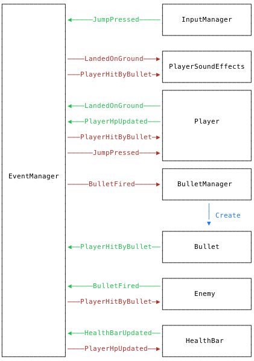

# Event-Driven Game Development in Unity

I'm going to spend a little time introducing a different way of looking at structuring your games in Unity. My code examples will apply to Unity specifically but this pattern can be applied in any engine or language and applies in almost any context, not just game development.

So, you've read the title and you might be wondering: what _is_ event-driven programming? In brief, it is taking the perspective that what happens in an application is a series of events and structuring the code around that belief. These events act as inputs and outputs between your various systems, i.e. `Jump Button Pressed`, `Player Landed On Ground`, `Sound Effect Played`. In regular old unity code this is what your method calls usually represent:

```csharp
void Update() {
  if (JumpButtonPressed()) {
    Jump();
  }
}

void LandedOnGround() {
  LandSound.Play();
}
```

This is simple & readable when everything can be captured in the same GameObject. What about a more complex example? Let's say we have an `Enemy` who fires `Bullets` at the `Player`. If a `Bullet` hits a `Player` then we want the `Player` to lose HP (and their health bar to update) and a sound to play. We also want the `Enemy` to celebrate if they successfully shoot the player.

<figure class="diagram">
  
</figure>

```csharp
// Enemy.cs

private float _timer = 0;

void Update() {
  _timer += Time.deltaTime;

  if (_timer > 2) {
    var bulletObject = GameObject.Instantiate(BulletPrefab, transform.position, Quaternion.identity);
    bulletObject.GetComponent<Bullet>().SetSourceEnemy(this);
    _timer = 0;
  }
}

public void BulletHit() {
  Animator.Play("Celebrate");
}
```

```csharp
// Bullet.cs

void OnCollisionEnter2D(Collision2D col) {
  var player = col.gameObject.GetComponent<Player>();
  if (player) {
    player.Hit();
    sourceEnemy.BulletHit();
  }
}
```

```csharp
// Player.cs

void Update() {
  if (JumpButtonPressed()) {
    Jump();
  }
}

public void Hit() {
  Hp -= 2;
  HealthBar.Update(Hp);

  HurtSound.Play();
}

void LandedOnGround() {
  LandSound.Play();
}
```

This is *alright* code but we're starting to introduce some very tight coupling between our scripts. Our bullet has to know all about both our player and the enemy. Worse still, our player class has to know about the UI! This is pretty much the opposite of the Single Responsibility Principle (the S in [SOLID](https://en.wikipedia.org/wiki/SOLID)). There are a lot of different modules here that need splitting up:

- Bullets - a common concern, should be handled by a BulletManager that can handle object pooling
- UI - user interfaces should not be directly linked to game entities
- Sounds - a PlayerSoundEffects manager should control how sound effects are played, whether they interrupt one another and global volume settings
- Enemy - just needs to shoot and be notified if the shot hit something
- Player - jump in response to jump button and react when hurt

Instead what if we introduced a mediator here? Something that could buffer the communication between the different systems in our game. I'm going to call this an `EventManager`. Our `EventManager` is going to let us define different event types and allow different components in our game to subscribe to be notified of those events. Have a look at [my implementation](https://gist.github.com/bfollington/39aa48eb09dc904c7636a6c676b98a1c) if you're interested, this will eventually be published as part of some open-source TwoPM branded Unity toolkit. If you open that link and feel slightly overwhelmed, don't worry so did I when I wrote it and the internal workings of it aren't important for this article.

```csharp
// Events.cs

public class PingEvent {}
public class PongEvent {}
```

```csharp
// Pinger.cs

void Start() {
  EventManager.AddListener<PongEvent>(
    (ev) => {
      Debug.Log("Pong");
    }
  );
}

void OnClicked() {
  EventManager.Dispatch<PingEvent>();
}
```

```csharp
// Ponger.cs

void Start() {
  EventManager.AddListener<PingEvent>(
    (ev) => {
      Debug.Log("Ping");
      EventManager.Dispatch<PongEvent>();
    }
  );
}
```

When we run this and click on the `Pinger` GameObject, we'll see the following output:

```
> "Ping"
> "Pong"
```

So, how would this look for our bullet example above?

<figure class="diagram">
  
</figure>

Woah, that just got a lot more complicated. There are lots more moving parts and, as you might expect, this is going to translate into more lines of code. This pattern is a great example of the fact that **lines of code has almost no relationship to the difficulty of understanding and working on a program**.

Think of it like this: our default way of setting things out is a big network of objects that all know about one another and talk directly to each other. But, with our `EventManager` we can instead focus on one *little* sub-problem at a time. I don't want to think about sound effects when I'm trying to redesign my user interface etc. Instead of thinking in objects, try thinking in behaviours. Our player is just a collection of behaviours:

```ts
// Behaviour: Update HealthBar
PlayerHitByBullet → PlayerHpUpdated → UiHealthBarUpdated

// Behaviour: Play Sounds
PlayerHitByBullet → PlayerHurtSoundPlayed 
LandedOnGround → PlayerLandedOnGroundSoundPlayed

// Behaviour: Jump
JumpPressed → PlayerJumped
```

Whether these behaviour exist all on one object or scattered around the scene, it doesn't matter. This lets us split up our code by what it *actually does*. So what does the our example actually look like? I'll focus on just `Player`, `HealthBar`, `Enemy`, `BulletManager` and `Bullet` for the example.

```csharp
// Player.cs

void Start() {
  EventManager.AddListener<JumpPressed>(
    (ev) => {
      Jump(); // Let's pretend this exists
      EventManager.Dispatch<PlayerJumped>();
    }
  );

  EventManager.AddListener<PlayerHitByBullet>(OnHit);
}

private void OnHit(PlayerHitByBullet e) {
  Hp -= 2;
  EventManager.Dispatch(new PlayerHpUpdated(Hp));
}
```

```csharp
// HealthBar.cs

void Start() {
  EventManager.AddListener<PlayerHpUpdated>(
    (ev) => {
      HealthBarDisplay.Value = ev.Hp;
      EventManager.Dispatch<HealthBarUpdated>();
    }
  );
}
```

```csharp
// Enemy.cs

private float _timer = 0;

void Start() {
  EventManager.AddListener<PlayerHitByBullet>(
    (ev) => {
      // Did the bullet THIS ENEMY fired hit?
      if (ev.Source == this) {
        Animator.Play("Celebrate");
      }
    }
  );
}

void Update() {
  _timer += Time.deltaTime;

  if (_timer > 2) {
    EventManager.Dispatch(new BulletFired(this));
    _timer = 0;
  }
}
```

```csharp
// BulletManager.cs

void Start() {
  EventManager.AddListener<BulletFired>(OnBulletFired);
}

private void OnBulletFired(BulletFired e) {
  var bulletObject = GameObject.Instantiate(BulletPrefab);
  bulletObject.GetComponent<Bullet>().SetSourceEnemy(e.Source);
}
```

```csharp
// Bullet.cs
private Enemy _source;

void OnCollisionEnter2D(Collision2D col) {
  var player = col.gameObject.GetComponent<Player>();
  if (player) {
    EventManager.Dispatch(new PlayerHitByBullet(_source));
  }
}
```

Phew. We're starting to get the picture now! While this is a decent amount of code it's actually pretty easy to consume. One of the best things about this architecture is that if you take any one of those files and read it, you don't *actually* need to check any other files to understand the logic. We can also easily extend this system without modifying any of our original code! If we take the above as-is and want to add sound effects we can do all that in a new component.

```csharp
// PlayerSoundEffects.cs

void Start() {
  EventManager.AddListener<PlayerHitByBullet>(
    (ev) => PlayerHurtSound.Play()
  );
}
```

That's it. No other changes and we get to stay focused on just our current small task. 

Hopefully after that small demonstration you're feeling at least a little positive about this way of doing things. Let's recap the benefits we've seen and touch on some others.

## Takeaways

### Loose Coupling

I don't think I need to say much about *why* loose coupling is good. This one of the most fundamental goals of software architecture: keep modules as isolated as possible. This, in turn, allows us to engage the wisdom of *"Favour composition over inheritance".* Unity already pushes us into thinking compositionally due to its entity-component structure. We can drop new components on to GameObjects and augment their behaviour in a piecemeal way. 

By adopting event-driven architecture we can take this pattern further, stepping outside the restriction of composition only within one GameObject. We can add, change and remove behaviours & restructure our scene graph freely, without having to rework code and battle broken object references.

### Extensibility

Let's say you're going to get your game on Steam. You've decided you want to add achievements! One of those achievements is going to be for jumping 10 times. Now, we could add a `jumpCounter` to `Player` and increment it each time, then unlock the achievement:

```csharp
// Player.cs

private int _jumpCounter = 0;

private void Jump() {
  // ... Jump logic ...

  _jumpCounter++;

  if (_jumpCounter >= 10) {
    SteamAchievements.Unlock("JumpedALot");
  }
}
```

But this is really ugly. Now our `Player` class has to know about Steam achievements! What about if we need to disable achievements if the game isn't being run from Steam? What if we want to add logic to persist the `_jumpCounter` between play sessions?

Instead, with events, we can just add a new `JumpAchievementTracker`.

```csharp
// JumpAchievementTracker.cs

private float _counter = 0;

void Start() {
  EventManager.AddListener<PlayerJumped>(
    (ev) => {
      _counter++;
      CheckAchievement();
    }
  );
}

private void CheckAchievement() {
  if (_counter > 10) {
    SteamAchievements.Unlock("JumpedALot");
  }
}
```

This leaves our `Player` code totally isolated and gives us a convenient spot to add any persistence logic. We can also easily enable and disable this behaviour by toggling `JumpAchievementTracker` on and off!

### Testing

Games are notoriously hard to write tests for. We often end up with so many interlaced dependencies that tests become a mess of mocking code. Now, to easily and effectively test Unity code it should not be part of a `MonoBehaviour` (since you cannot easily run `MonoBehaviour`s outside of Unity). I chose to keep everything in `MonoBehaviour` form above for simplicity & iteration speed, any methods that need testing I factor out into pure static functions and test those in isolation.

## What's Next?

That's enough for today! In the future I plan to cover how this mixes with:

1. Inversion of Control & Dependency Injection with [Zenject](https://github.com/modesttree/Zenject)
2. Coroutines & Cutscenes
3. Observables (via [UniRx](https://github.com/neuecc/UniRx))
4. Data Aggregation and Persistence

### Resources

- [EventManager.cs](https://gist.github.com/bfollington/39aa48eb09dc904c7636a6c676b98a1c)
- Taking this further with [Event Sourcing](https://martinfowler.com/eaaDev/EventSourcing.html)