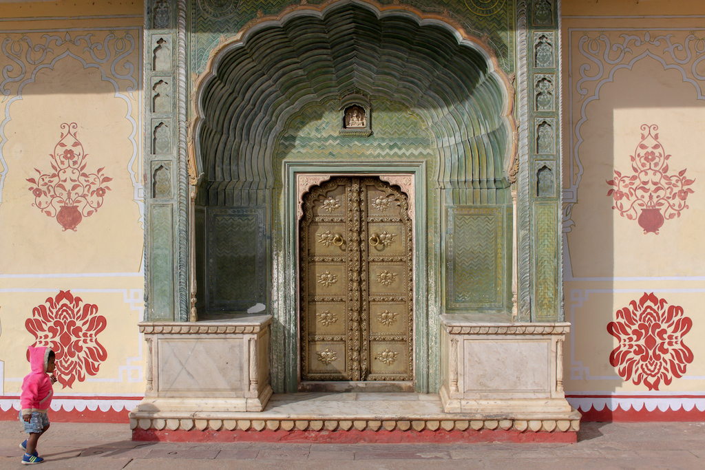

# More Than Mindfulness

Meditation is hot right now. Chances are if you grab a stranger on the street and ask them, they've probably heard of meditation and some of its alleged benefits. They probably also know that grabbing strangers in the street is not an especially meditation-y thing to do. Despite this, public understanding and perception varies wildly. I feel compelled to chime in and provide my perspective as a skeptic, an atheist and (I like to think) a reasonable person. I personally had a *great deal* of trouble accepting meditation due to its adjacent mysticism. It seemed that I would be spending most of my time sorting through concepts one by one and filing them into "spooky" and "logical". 

## How did I get started?

Like many, I came to meditation looking for solutions. Since my mid-teens I've persistently struggled with both depression and anxiety. For years I kept this hidden and remained mostly functional, I learned to cope with these episodes as they came but I was frustrated that the struggle seemed endless. Stubbornly I decided not to pursue the typical options. I've seen first hand the personal challenge and limited success of medication-based interventions. I recognise and freely admit that they are highly effective for some, equally I think I'm well within my rights to personally steer clear. Additionally I felt too insecure to try therapy, and to this day I'm still infatuated with the idea of being totally self-sufficient.

Things came to a head just after I graduated from university. I was totally unsure where my life should be heading next. I had people on all sides telling me to pursue dreams that weren't mine and _no idea_ how to be happy. I decided to step back and take stock of my life. I started researching, there *had* to be more options on the table. Reading other people's stories let me take the cliched first step: recognising my problems. I knew that I often felt **bad** but had never made an earnest effort to pinpoint common triggers or situations I should avoid.

I've always been introspective, though until this point it was more of a wallowing introspection. Now I was really starting to dig in and work out *why* certain things made me anxious or upset. I started poking at my insecurities and fears. This might surprise some of you but marijuana was a *huge* aid in this period. The alternative (often calmer) perspective it offers allowed me to get a more objective view of myself. Some time passed and I thought I was ready to step up the efforts to improve my life. Growing up my father had an on-and-off relationship with meditation, so I have known *vaguely* what it is for a long time.

I originally had dismissed it on inspection because... It seemed boring (I was young *ok*). I found the idea of quieting your thoughts both unlikely and distasteful. I was forced to revisit this through my latest research, I'd seen overwhelming support for meditation coming from people who appeared to be far smarter than me. I knew it would be difficult. I knew I would be embarrassed to tell people. I wasn't even sure it would do anything.

But I did it. As with all modern self-improvement efforts, I started with an app. I promised I would meditate for 30 days, 5 minutes a day. I knew in the first 30 seconds of session one that I was going to have to push myself into this.

## Fast forward

Long story short, I made it through 30 days. This was not easy but, thankfully, I am quite good at making sudden drastic changes to my behaviour. I had a new problem. Now I was convinced that meditation had *massive benefits*. I started to wonder just how far down this path I could go and what lay ahead. I remembered I was still embarrassed about it. 

I felt much calmer, but there was more to it than that. I felt like I was perceiving things that were totally out of reach before. Meditation was giving my the clarity I needed to be intimately aware of my current mental, emotional and physical state. I got excited that maybe meditation would let me gain **control** of my mind (note: *this is not the goal*). I started reading about meditation, mindfulness and Buddhism to understand better the progression of the process. At this point I was surprised at how *rational* meditation teachings were on the whole.

I expected, naively, that Buddhism would constantly invoke the supernatural and spiritual realms. It became obvious that the resistance to meditation I'd picked up stemmed mostly from culturally enforced xenophobia pointed towards The East. To this day I would not call myself a Buddhist, I like the idea that we should all have our own personal understanding of *spirituality* rather than having to consolidate, package and label our beliefs. Nonetheless, I started seeing Buddhism as a good thing rather than another religion to steer clear of. I now recognise that atheism does not imply that religions have nothing to teach us, we just need to honestly evaluate their teachings and extract only the lessons that hold up under scrutiny.

## The unexpected

I journeyed further into the philosophy surrounding meditation, and things got *really* interesting. It's noteworthy that I set out on this journey with the humble goal to "feel calmer". To be clear, this is exactly what I got but I also got *much* more. I think meditation has become a common spiritual onboarding funnel, people come for the convincing medical benefits and stay for the deeper philosophy. This is probably a strategic move on the part of meditation researchers, we know now that people expect evidence and research behind claims. So we lead with what we can study, the medical benefits, while knowing that people will inevitably find the deeper benefits. I am personally excited for a future where we can study the outcomes of personal philosophical choices too. 

Once I realised I was on to _something_ I looked for help, I went on to read about Zen, Hinduism & Taoism, listened to Alan Watts, Terrance McKenna and Sam Harris lectures and attempted to integrate these ideas with my meditation experiences. I increased the length of my sessions to 10, 15 and 20 minutes, eventually forgoing guidance and meditating in silence. Over time this bore many fruits: being content with the moment, fostering a _universal_ feeling of love, reevaluating my relationship with the universe, diminishing my ego and finding a much deeper interest in philosophy.

*This part can scare people off* because it sounds an awful lot like a religion. Except, when examined, you won't find any of the trademarks of traditional religion. By which I mean:

- Dogmatic, outdated and unchangeable teachings
- Blind faith in the supernatural _(I'm aware some argue that "feeling it" is evidence enough, I disagree)_
- Judgemental and discriminatory cultural norms packaged as spiritual guidance
- The implication that we must all believe exactly the same thing

You can embark on this journey entirely alone, with no prescriptive path and find your own version of all these ideas.

With time I realised that I would never be free of the emotions I'd been trying to exorcise. They were fundamental elements of my experience. I found that by accepting them, it lessened the control they had over me. I found that life was much easier when you can instantly call to mind the fact that everything is transient and these feelings will pass. This both eased my suffering and forced gratitude upon me.

Despite never having believed in anything vaguely resembling a god before, I was even developing sympathy for this perspective. The idea of capital-f Faith remains wholly unconvincing but it turns out that you can get something very god-like without having to *just believe* *in it*. As I read more about the cosmos and the more idiosyncratic aspects of physics I realised that there are *a whole lot of ways* to look at  reality. Alan Watts had ignited my imagination in terms of the perspectives I could take on the universe. I have become increasingly fond of thinking of all of reality as a fractal. You, everyone and everything are simply a part of one complex system and if you call _that_ god I can kinda get into it. Partially because it fits the output, partially because fractals looks amazing. I, personally, find the idea that all of reality exists as an interconnected, infinite continuum very beautiful. It gives me an existential comfort that remains difficult to put to words.

## This sounds kinda dumb

Acknowledge that whether you like it or not, you already have a belief system. There is some way in which you understand the universe and your place in it. Whether it came from your parents, your teachers, your peers, from books or from your own philosophical thinking. It may not be a belief system with a name, or one that anyone else has ever spoken about, but it's still there. By their very nature these types of philosophical belief are not provable or falsifiable. We will likely never be able to comprehend or measure the "true" nature of reality. Thus, there are an infinite set of perspectives we could take to satisfy ourselves. Given that premise, there must be many belief systems that people choose between. In turn it's reasonable to think that these vary in efficacy in terms of people's happiness, so *it is possible* that some belief systems are superior to others. 

The criteria for what is measurably superior is left to a personal choice here, it's heavily influenced by your politics. Regardless, once you can accept this it becomes a matter of finding the *most optimal* belief system. For me, this model of the universe is the most agreeable I've found so far. It is:

- Deeply compatible with science
- Grounded in common everyday experience
- Non-prescriptive in your habits
- Comforting in times of difficulty
- Radiant in times of joy
- Anecdotally helpful in being a more compassionate person

## I'm not telling you to meditate

I'm not trying to convince you to be anything like me. Not everyone has as much to gain from meditating, some people find calm contentment more organically. Not everyone has to try and push the boundaries, 5 minutes every now and then is better than nothing. Would the world be a better place if everyone meditated? Who knows, perhaps, but forcing these ideas upon people is somewhat antithetical to the philosophy being shared. An idea has to come along at the right time and in the right format to really take hold. All I am saying is, if it does take hold, know that there is much more here than sitting on the floor and feeling relaxed. There are profound insights about consciousness, identity and reality to be found and none of them require _faith_. 
