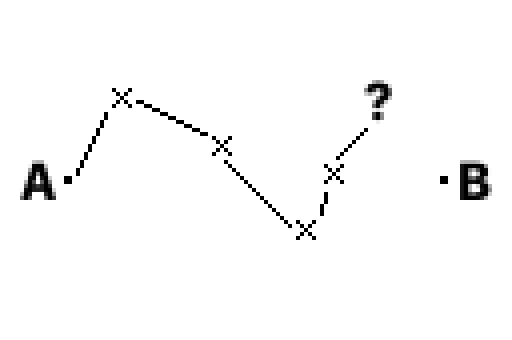

# Reorientation

Every week I find myself in the same headspace. Usually it's on Sunday night, or Monday morning, but it can strike any time. It's sudden and yet expected, the message pops into my head:

> "What's the point of doing any of this?"

I push myself a lot in life. Not that I'm some world class physical performer, creative genius or business mastermind... It's _more_ like a slave driver and slave all in one 😅. I ask for discipline, focus and _enthusiasm_. I ask for the ability to reach higher. To grow as an engineer, an artist, a scientist, an athlete, a student, a friend, a son and a lover. There are few days off and when they come it can be hard to avoid the feelings of guilt. 

Whether or not this sounds like a life you'd enjoy, I'm sure you can see that it can be a difficult one. The difference between a day I love and a day that crushes me under the weight of the performance comes down to one, tiny, perspectival point. How clear is my vision of where I'm going? Some days the image of the life I'm building is so clear that I might wake up there. Others... It's hard to recall the faintest glimmer. That is not to say that the vision is _consistent_ at all, I'm simply trying to draw you to the crucial role it plays. 

I do know where I'm going in _vague terms_ though. I imagine days where I control the entire schedule, where I can read, train, work, write, meditate and move between them freely. I imagine ambitious projects that impassion me and that touch people's lives both pragmatically _and_ emotionally. I imagine friendships where we laugh in hysterics, tear-up with sincerity and argue with the intellectual fervour of philosophers. I imagine creative peers and partners who inspire and are inspired by me, pushing me further while letting me feel heard. I imagine a romantic partner who I can support and admire and who helps remind me of this very vision. Not simply through their words but through their existence and the awe-inspiring beauty of it (this is a conceptual beauty, rather than a statement about physical attraction, but that'd be alright too). Above all, I imagine contentment. Not to _sit_ in contentment but to have internalised that contentment in the moment is possible at all times and, in turn, to remember it often.

When I see it laid out on the page it seems impossibly distant... But I'm closer now than I was a few years ago, perhaps even closer than I was a few weeks ago. 

> A is some point before now, B is some point after. Each line is one push forward, each X is a moment of reorientation. If you have a target then life is a series of nearer and nearer misses.

I'm awful at actualising long term visions, I think most of us are. They incessantly slither into new forms upon examination, all while lingering just out of reach. Regardless, the only remedy I've found for listlessness is to do what I'm doing right now, sit down and take the time to gently ask yourself what you _really_ want. I think that doing this more often would be the _smart_ idea but, cruelly, when we need this most we are least likely to remember that reorientation is even possible... But _maybe_ I just reminded you?